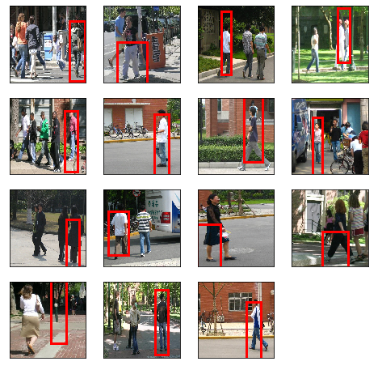

# RPN
This is Region Proposal Network training example using VGG16 backbone with Pytorch

This is RPN netwrok training code example. Anchor box generation code is based on Guide to build Faster RCNN in PyTorch written by Prakashjay. I added training code for arbitrary image size on top of it with arbitrary batch size. 
Trainig data can be downloaded from Pytorch tutorial page. or use this link [Penn-Fudan Database for Pedestrian Detection and Segmentation](https://www.cis.upenn.edu/~jshi/ped_html/)
reference paper
[https://arxiv.org/abs/1506.01497](https://arxiv.org/abs/1506.01497)

**contents**
For training use rpn.ipynb file.

**validation results only after 153 dataset and 17 validation set with 20 epoches**

**To do list**
- Add proposal lyer to send final filtered proposal ROI to fast RCNN
- I will build complete Faster RCNN code using this RPN network
